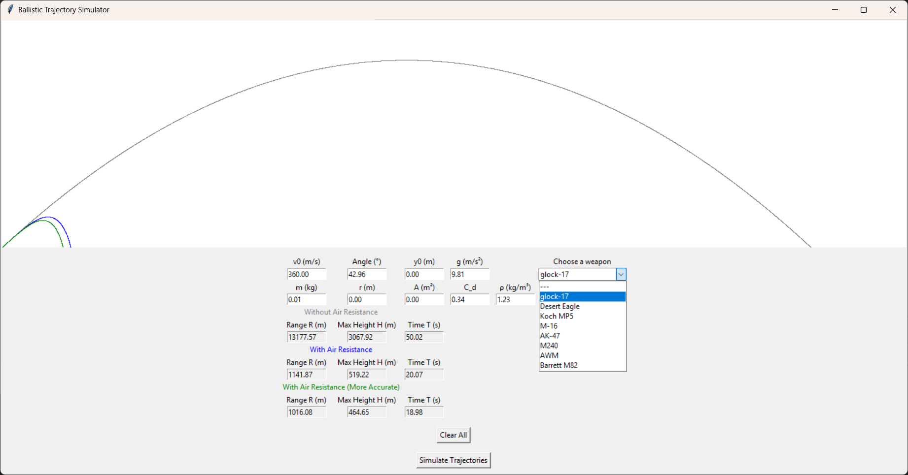

# Ballistic Trajectory Simulator

### How to use
When launched, this program will create a window where there shall be one plain space 
for the script to draw the curve and several input fields. The thing on the right is a dropdown-list 
where you can pick a predefined weapon, or you can enter custom data tho the 9 fields below the top blank space.
The last 6, in case you chose a weapon 9, windows are read-only for they are for the results. When you choose
everything you want, click on the "Simulate Trajectories" button to make the program start counting.

### What happens
After simulating the data, there will be two or three lines on the formerly blank canvas depending on
whether you chose in the dropdown list. Those lines symbolise the output in the bottom boxes.

### A peculiarity
When you choose a weapon in the dropdown-list there appears a third line of boxes for results,
but with a green title. Pre-defined weapons have more precise data based on tables which vary with speed,
and it is even more variables. These results are more precise than the blue ones, but not by so much.

##### Coming soon (sort of)
At the very bottom of the code, there are some todo´s waiting. It is mostly concerning visual
stuff and the last smoothing up stage of the program. I will work on these anon.